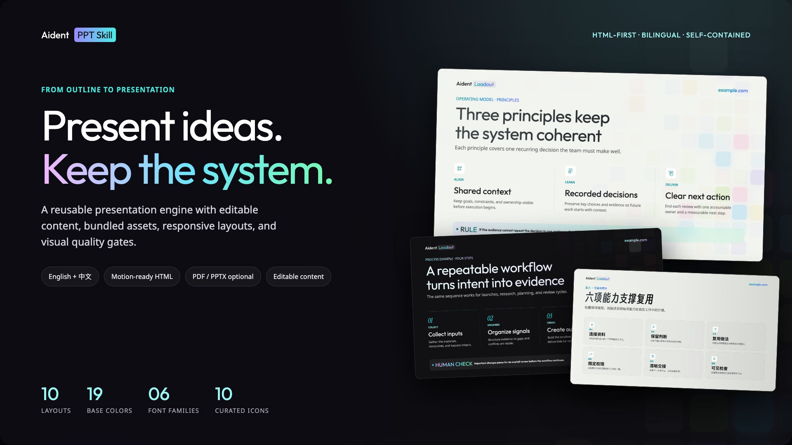
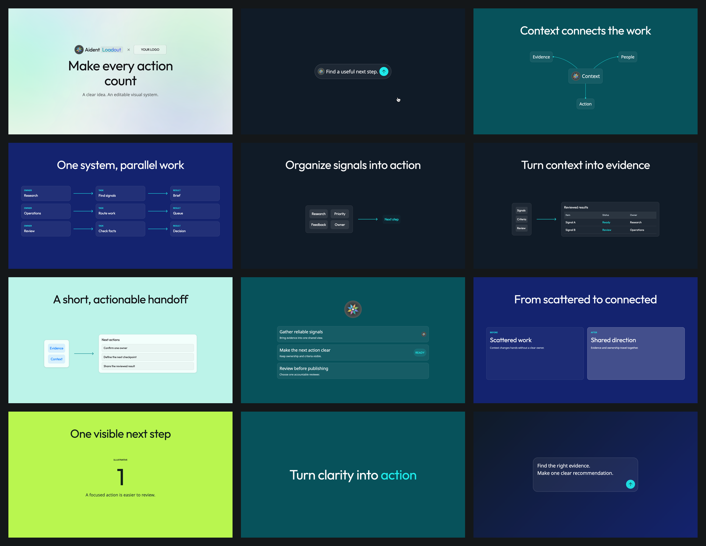
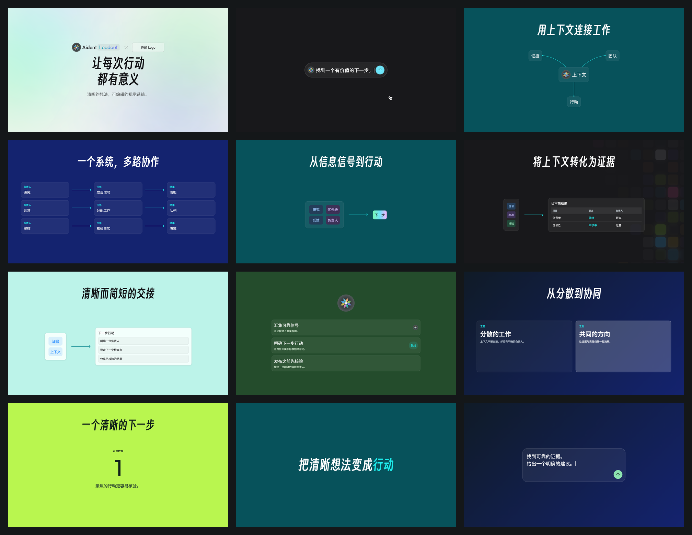
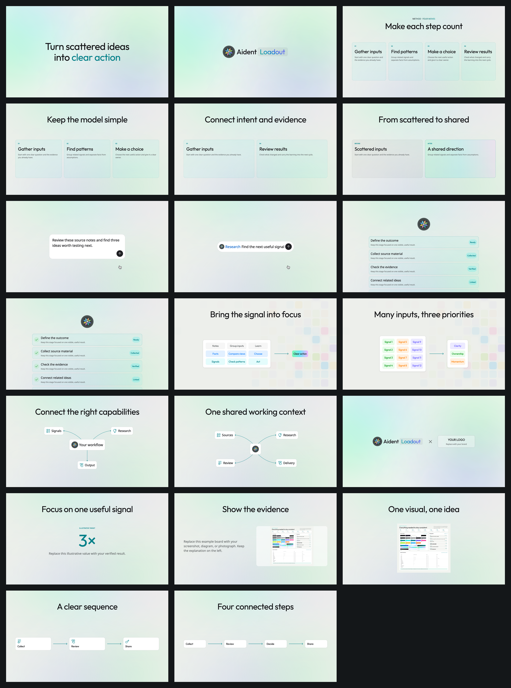
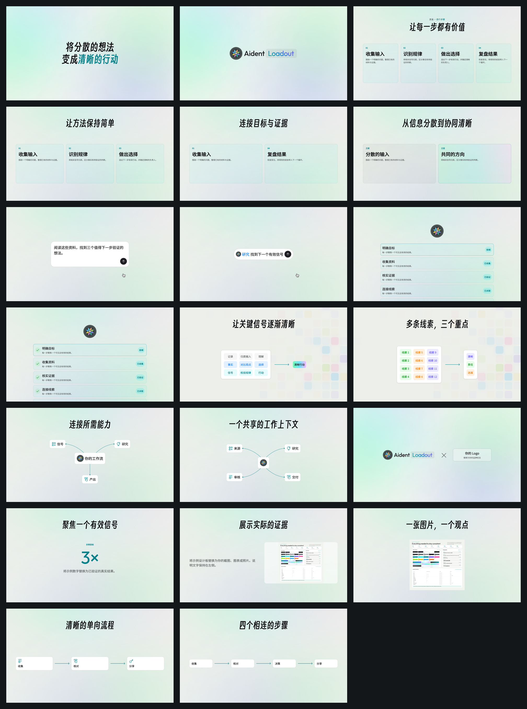
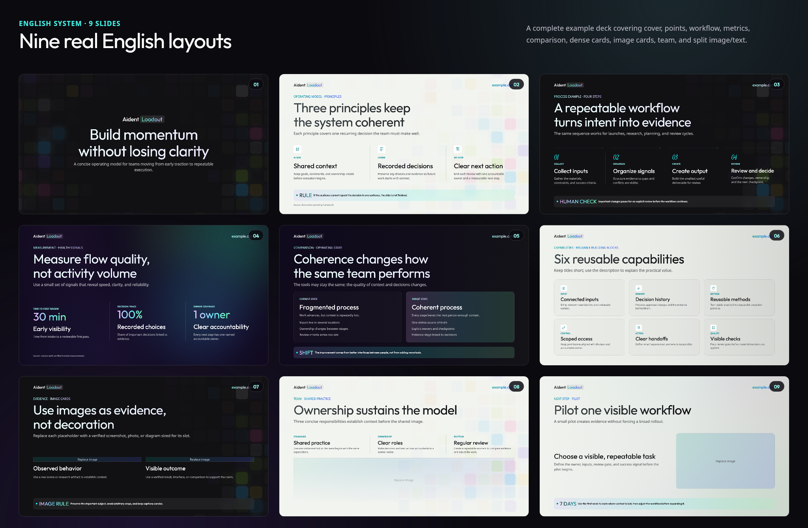

# Aident PPT Skill

[Dependencies and maintenance / 依赖安装与维护检查](./CONTRIBUTING.md)



[Full English README / 完整英文文档](./README.en.md) · [Skill instructions](./SKILL.md) · [Layout catalog / 页面版式目录](./references/layout-catalog.md) · [Multi-Agent workflow](./references/multi-agent-workflow.md)

A self-contained, publicly installable bilingual presentation Skill. Provide the audience, goal, and content outline; the Agent uses packaged layouts, components, font roles, icons, backgrounds, and quality gates to generate a consistent HTML presentation by default. Portable single-file HTML, PDF, and editable PPTX are optional. Public visibility does not mean every branded asset is open-source; read [NOTICE.md](./NOTICE.md) before use or redistribution.

一套可离线运行、可公开安装的中英文演示文稿 Skill。用户只需提供受众、目标和内容框架，Agent 即可使用包内的版式、组件、字体策略、图标、背景和质量规则，默认生成统一风格的 HTML 演示；单文件网页、PDF 与可编辑 PPTX 均为按需选项。公开可见不等于所有品牌素材都采用开源许可，使用和再分发前请阅读 [NOTICE.md](./NOTICE.md)。

Bring your own brand: replace the cover and upper-left slide mark with your own PNG, JPG/JPEG, WebP, or SVG. Use one logo for both themes or provide separate Light/Dark files; the source aspect ratio is always preserved.

自定义品牌：可用自己的 PNG、JPG/JPEG、WebP 或 SVG 替换封面和内页左上角 Logo；支持单一 Logo 或 Light/Dark 两套文件，始终保持原始比例。

## Motion Slides / 面向视频编辑的 HTML 版式

新增深浅主题与组合镜头：同一模板可选 Light/Dark；支持 Logo＋标题、1–3 行并行流程（每行2–4节点）、标签到表格/清单结果、独立输入光标和动画层。中英文均支持，所有文字、Logo 和图片都可替换；不强制每页用完所有组件。完整规则见 [主题与组合](./references/motion/themes-and-combinations.md)。

背景提供中性、青绿、深蓝、黄绿四套配色及深浅模式；品牌色优先纯色，深蓝另有可选渐变。Backgrounds offer neutral, teal, deep blue and lime palettes in Light/Dark; brand fills default to solid colors, with an optional deep-blue gradient.

所有 11 类 Motion 布局及其组合变体均支持；主题与配色可整套设置、逐页覆盖，底色变化不改变排版。All 11 Motion layout families and their variants support deck-level themes/palettes with per-slide overrides, without changing layout geometry.

默认搭配有明确倾向：亮绿优先大数字／关键词，List 优先品牌纯色，开场与结尾优先浅色或品牌纯色；其他组合仍可显式选用。Recommended pairings favor lime for large metrics/keywords, solid brand colors for Lists, and Light or solid brand colors for openings/closings. Other combinations remain supported. See [style routing / 配色与版式倾向](./references/motion/scene-planning.md#choose-the-default-style-deliberately).

Light/Dark themes and combined shots: brand + title,1–3 parallel workflow rows with2–4 nodes each, tags to editable table/list results, separate input caret and animation layers. Both languages support fully replaceable copy, logos and images. Components are optional, not a checklist. [Specification](./references/motion/themes-and-combinations.md).

深色预览包含纯墨蓝 `#101B27`、品牌深青 `#07525B` 与深蓝 `#14236F`；最后一张展示可选深蓝渐变。Dark previews include solid ink, brand teal and deep blue; only the final scene demonstrates the optional blue gradient.




Choose `meta.mode: "motion"` for simpler, more visual HTML scenes. English and Chinese share 11 layout families: statement, brand, cards, comparison, input, scrolling list, synthesis, Joint/hub, left-to-right workflow, image and metric. All copy, logos and images are replaceable. Independent layers and a handoff manifest let GSAP, Hyperframes or Remotion author the animation later.

按[镜头语义](./references/motion/scene-planning.md)选模板：输入问题用 Input、品牌亮相用 Logo、连接关系用 Joint、汇聚转化用 synthesis，不默认套卡片。HTML 内容默认完整可见，无内置入场动画；整个画布就是镜头，长列表没有内部滚动窗口或预设位移。生成时询问是否替换 Logo，未指定默认 Aident，明确不要才隐藏。

Choose layouts by visual meaning: Input for prompts, Logo for identity, Joint for connections and synthesis for transformation. HTML is static and fully visible by default. Lists clip only at the slide camera, with no prescribed travel. The Agent asks about Logo replacement; unspecified means Aident, explicit no-Logo hides it. Downstream tools own animation.

新建讲解/演示优先从 [英文起步模板](./examples/motion/starter.en.json) 或 [中文起步模板](./examples/motion/starter.zh.json) 开始，直接包含大 Logo、Input、Joint 连线图、汇聚与列表；按实际故事删改，不强制每种都用。标签默认同级同字号、等宽 Fill、文字居中，也可统一左对齐或使用独立的 Hug 组合，详见[标签排版规范](./references/motion/synthesis-composition.md)。文字、图标、连接线、完整列表场景和轨道均可独立编辑；没有内部列表裁切窗口，动画只提供建议。

Start explainers from the bilingual starters with Logo, Input, Joint, synthesis and list shots; adapt them to the story. Peer tags default to equal-width Fill, one size and centered text. Uniform left alignment and Hug compositions are supported. Geometry checks and visual review are separate requirements.

Logo defaults / 默认标志：品牌镜头使用完整图形＋文字 Logo；列表与流程节点保留独立图形。两侧可分别替换，不将同一品牌拆成两个 Logo。Brand shots use the complete lockup; compact identities use the standalone mark. Either pair slot can be replaced independently.

Independent controls / 独立组件接口：Logo pairs allow replacing or animating either side; Input exposes separate text, Send button and inline arrow, with five explicit states. Linear workflows support 2–4 nodes without a center; hubs support 1–4 satellites. Light tags offer six semantic colors; Dark uses translucent white peers and brand-cyan emphasis, without opaque green/purple chips or rainbow output. Timing defaults are shorter, overridable suggestions. 双 Logo 可分别替换和动画编辑；Input 文字、按钮和箭头独立，提供五种手动状态；单向流程与中心关系图分开选型，浅色标签支持六种分类色；深色使用半透明白色同级标签与品牌亮青色强调，不使用深绿／深紫色块或彩虹输出渐变。详见 / See [editable component rules](./references/motion/editable-components.md) and [bilingual control examples](./examples/motion/controls.en.json).




```bash
npm run motion:starter:en
npm run motion:starter:zh
# Full component catalog / 完整组件目录：
npm run motion:en
npm run motion:zh
# Optional browser QA / 可选运行示例检查（交付前必须检查）
npm run motion:qa:en
npm run motion:qa:zh
```

[Usage and rules / 使用规则](./references/motion/README.md) · [Layout details / 版式细节](./references/motion/layouts.md) · [Editable content / 内容替换](./references/motion/content.md) · [Animation handoff / 动画交接](./references/motion/animation-handoff.md)

The folder includes HTML, editable content JSON, suggested timing, a layer/asset index and bundled fonts. It is ready for animation adaptation, but is not itself a native video-engine or NLE project. / 输出包含 HTML、内容 JSON、建议时间轴、图层与素材索引及字体；可继续改编为动画项目，当前交付本身并非剪辑工程或原生视频引擎项目。

## Design system at a glance / 一眼看懂这套系统

The preview below is generated from the packaged registries and bundled font files, so its inventory stays synchronized with the Skill. / 下图直接读取包内 registry 与字体文件生成，能力数量和字体角色会与 Skill 保持同步。


| Packaged capability / 已打包能力 | Count / 数量 | Includes / 包含内容 |
|---|---:|---|
| Page layouts / 页面版式 | 10 | Cover、Point、Card、Metric、Workflow、Comparison、Image Cards、Team、Split、Full-bleed |
| Component types / 组件类型 | 10 | Header、Source、Point、Step、Metric、Callout、Card、Workflow、Comparison、Image Mask |
| Background treatments / 背景处理 | 8 | Light / Dark × Base、Elements Cover、Elements Inner、Atmosphere |
| Raster asset policy / 位图策略 | Lossless WebP | Backgrounds、textures、Hero and Showcase preserve decoded pixels; PPTX converts to PNG in memory / 背景、纹理与预览均为无损 WebP，PPTX 内存转 PNG |
| Color system / 颜色系统 | 19 base + 9 gradients | Semantic colors、title gradients、emphasis and Callout gradients / 语义色、标题与强调渐变 |
| Bundled fonts / 字体 | 6 families | 3 English + 3 Chinese families with licenses and role index / 英文 3 套 + 中文 3 套 |
| Curated icons / 图标 | 10 × Light / Dark | Selected from the existing design system; no redrawn glyphs / 来自现有设计系统，不自行描画 |
| Languages / 语言 | 2 | Independent English and Chinese hierarchy, line height, and tracking / 中英文独立字体层级、行高与字距 |

## Complete nine-slide coverage in both languages / 中英文完整九页覆盖

### English example / 英文示例

Nine real layouts covering cover, points, workflow, metrics, comparison, dense cards, image cards, Team, and split image/text.



### Chinese example / 中文示例

The matching Chinese deck validates its own display, body, label, numeral, line-height, and tracking tokens. / 对应的中文示例使用独立的标题、正文、标签、数字、行高与字距 token。


## Quick start / 快速开始

### 1. Install / 安装

Copy the complete repository into the Agent's Skill directory; do not copy only `SKILL.md`. / 将整个目录复制到 Agent 的 Skill 目录。不要只复制 `SKILL.md`，字体、背景、图标、运行时和参考文档都属于 Skill 的一部分。

Codex：

```bash
cp -R /path/to/aident-ppt-skill ~/.codex/skills/aident-ppt-skill
```

Claude Code：

```bash
cp -R /path/to/aident-ppt-skill ~/.claude/skills/aident-ppt-skill
```

Other local Agent environments need file access, Node.js 20+, and browser preview support. / 其他支持本地 Skill 的 Agent，可把目录放入其约定的技能路径；至少需要文件读写、Node.js 20+ 和浏览器预览能力。

Install the complete public repository with the following command. / 使用以下命令安装完整公开仓库，Skill 名保持 `aident-ppt-skill`：

```bash
npx skills add https://github.com/Edward-J-create/aident-ppt-skill --skill aident-ppt-skill
```

### 2. Give the Agent an outline / 给 Agent 一段内容框架

Use the English prompt below or the matching Chinese prompt; both exercise the same editable system. / 可使用下面的英文或中文提示词，两者调用同一套可编辑系统。

```text
Use $aident-ppt-skill to make an 8-slide English strategy presentation.
The audience is business leadership. Explain the current situation, three opportunities,
an implementation workflow, and success measures. Deliver folder HTML only unless I explicitly request PDF or editable PPTX.
I will supply a replaceable logo and images. Do not invent customers, revenue, or performance claims.
```

```text
使用 $aident-ppt-skill 制作一份 8 页中文产品策略演示。
受众是业务负责人，目标是说明现状、三个机会点、实施步骤和衡量指标。
默认只输出文件夹 HTML。使用通用占位内容；右上角显示 example.com；
我提供的 logo 和图片可以替换，不要编造客户、收入或效果数据。
```

Agent 会把内容先整理成叙事与布局，再生成和检查各格式，不会机械地把每一条 bullet 变成一页。

### 3. Run an example / 直接运行示例

```bash
node scripts/check-fonts.mjs
node scripts/generate-deck.mjs \
  --input examples/deck.example.zh.json \
  --out output/example-zh
```

Open `output/example-zh/index.html` to present; press `P` for presenter mode. / 打开 `output/example-zh/index.html` 即可演示。按 `P` 进入演讲者模式。

## What is included / 能力范围

The package includes bilingual typography, reusable 1920×1080 layouts, Light/Dark visual treatments, editable content, replaceable branding, HTML-first delivery, optional PDF/PPTX exports, presenter controls, and executable Single-/Multi-Agent QA workflows. / 包内覆盖中英文字体、可复用版式、深浅色视觉、可编辑内容、自定义品牌、HTML 优先交付、可选 PDF/PPTX、演讲控制，以及可执行的单/多 Agent QA 流程。

- 中英文两套明确的字体层级、字号、行高和字距规则。
- 1920×1080、16:9 的固定画布与可复用布局系统。
- Light/Dark 背景、纹理叠加、渐变文字、kicker、callout 与对比色；Elements 明确拆分 Cover/Inner，Atmosphere 可用于 Light/Dark 内页。
- Point、Card、Metric 的 2/3/4/6 组合；Workflow 的 3/4 步组合。
- 图片卡片、团队蒙版、固定左文右图、全幅图片、对比页等素材版式。
- label、icon、header、source、callout、workflow 箭头等可选变体。
- 所有页面文案都由 JSON 填充并可编辑：kicker、标题、副标题、Point/Card/Metric/Step/Comparison 的各级文字、数值、列表、Callout、来源与演讲备注。
- 可替换 logo、右上角文字/网址、内容图片、裁切位置与来源。
- 文件夹 HTML 为默认主产物；单文件 HTML、PDF、可编辑 PPTX 与网页托管按需输出。
- 文件夹 HTML 只复制当前 deck 实际引用的背景、纹理、图标、Logo、用户图片和所需语言/组件字体，不再把整套 `assets` 塞进每份输出。
- 包内背景、纹理、Hero 与 Showcase 使用 Lossless WebP；Logo/Icon 保留 SVG；PPTX 在导出时把引用的 WebP 动态转成缓存 PNG，不保存重复 compiled 背景。
- 普通、Audience 与 Embed 模式会在不同浏览器窗口中完整居中缩放 1920×1080 画布，不裁切右侧或底部。
- 键盘导航、概览、低功耗模式、动画和演讲者视图。
- 静态校验、浏览器重叠/越界检查、PDF/PPTX 渲染检查。
- 单 Agent 流程和具备文件所有权、handoff、并行 QA 的真实多 Agent 流程。

## Good fit / poor fit / 适合与不适合

Good fit: proposals, product introductions, strategy reviews, operating frameworks, team/process stories, and evidence-led presentations. / 适合：对外方案、产品介绍、策略汇报、方法论、团队/流程介绍、带少量关键指标和图片证据的高质量演示。

Poor fit: spreadsheet-heavy reports, dense training manuals, raw transcripts, or real-time co-editing of one PPTX. / 不适合：以超大表格为主体的报表、要求在一页容纳大量明细的培训手册、未经整理的逐字稿、需要实时多人同时编辑同一个 PPTX 文件的场景。后者应先在协作平台完成内容，再用本 Skill 生成发布版。

## Output formats / 输出格式如何选择

| Need / 需求 | Recommended / 推荐输出 | Notes / 说明 |
|---|---|---|
| 动画、演讲者备注、网页演示 | 文件夹 HTML | 视觉与交互最完整 |
| 离线发送或单文件交付 | 单文件 HTML | 字体与素材内嵌，文件会更大 |
| 打印或锁定视觉 | PDF | 每页固定 16:9，无可编辑元素 |
| 在 PowerPoint 继续修改 | PPTX | 文字和主要形状可编辑，部分网页效果会近似 |
| 发布为网页 | 文件夹 HTML | 可部署到任意静态 HTTPS 主机 |

HTML is the default renderer and visual source of truth; PDF and editable PPTX are optional exports. / HTML 是默认主渲染与交付实现。除非用户明确要求，否则不额外导出 PDF 或 PPTX。PDF 从同一 HTML 导出；PPTX 从同一份解析后的 JSON 生成原生文本、形状、图片和备注，因此按需导出时内容仍保持同步。

HTML 是视觉标准，必须优先保证。PPTX 是可编辑的可选适配格式；目标电脑若未识别包内字体，或 PowerPoint 使用了不同的字体度量，可能需要人工微调，不能为了迁就 PPTX 的字体替换而破坏 HTML 排版。

选择 JSON + HTML，是因为 Agent 可以可靠地读取、修改和验证结构化内容与 CSS 几何；同一内容源还能驱动网页动画、PDF 和原生 PPTX，而不需要从一张张不可编辑的设计截图反推文字。

## Single-Agent workflow / 单 Agent 工作流

Use for a small deck, simple asset requirements, or one output format. / 适合 2–8 页、素材简单或只输出一种格式的任务。

1. 读取 `SKILL.md`，按需读取相关 reference。
2. 把请求整理成受众、目的、叙事和逐页 takeaway。
3. 选择已注册的页面布局和组件数量。
4. 写入符合 schema 的 `deck.json`。
5. 检查字体和素材路径。
6. 生成 HTML，再导出所需的 PDF/PPTX。
7. 对每个请求的格式执行自动检查和逐页视觉检查。

完整规则见 [SKILL.md](./SKILL.md)。

## Multi-Agent workflow / 多 Agent 工作流

Use for 10+ slides, multiple sources, concurrent formats, or an explicit parallel-Agent request. Specialists write bounded handoffs; one lead owns deterministic assembly. / 适合 10 页以上、多源材料、多格式同时交付，或用户明确要求并行 Agent 的任务。它不是“多个 Agent 同时改一个 PPT”，而是单写者所有权下的分工与确定性组装。

```text
Lead / Orchestrator
  ├─ Narrative Architect ──> handoffs/narrative.json
  ├─ Asset Curator ────────> handoffs/assets.json
  └─ Notes Editor ─────────> handoffs/notes.json
               │
               v
         Lead assembles deck.json
               │
       HTML / 可选 PDF / 可选 editable PPTX
               │
  ┌────────────┼────────────┐
  v            v            v
HTML QA      PDF QA       PPTX QA
```

角色表在 [`agents/roles.json`](./agents/roles.json)，仓库级文件所有权在 [`AGENTS.md`](./AGENTS.md)，每个角色的可直接分派提示词在 [`agents/prompts/`](./agents/prompts/)。

### Initialize a run / 初始化一次运行

```bash
node scripts/init-multi-agent-run.mjs \
  --brief /absolute/path/brief.md \
  --out /absolute/path/run \
  --language zh \
  --formats html
```

初始化后，Lead 将专业任务分派给 Agent。每个 Agent 只能写自己的 handoff 或 QA 目录；最终 `deck.json`、`output/` 和 release 由 Lead 单独拥有。

### Validate and assemble / 验证并组装

```bash
node scripts/validate-agent-run.mjs --run /absolute/path/run --phase planning
node scripts/assemble-agent-run.mjs --run /absolute/path/run
node scripts/validate-agent-run.mjs --run /absolute/path/run --phase assembled
```

只有 narrative 为 `complete`，assets/notes 为 `complete` 或 `waived` 时才可组装。未知 slide ID、重复 ID、越权写入声明和无效 item 索引都会失败。

### Release gate / 发布门禁

各格式 QA Agent 只负责检查和写报告，不直接修改最终稿。Lead 修复后重新生成，最后运行：

```bash
node scripts/validate-agent-run.mjs --run /absolute/path/run --phase release
```

所有请求的文件与对应 `pass: true` 报告齐全后才能发布。完整协议、失败恢复和 Codex/Claude/Cursor 的分派模式见 [multi-agent-workflow.md](./references/multi-agent-workflow.md)。

## Presentation-mode design rules / 商务演示模式规则

Motion Slides have separate [layout rules](./references/motion/layouts.md), including centered headings, unchanged Joint connectors and lists clipped only at the slide camera. / 以下规则用于商务演示；Motion Slides 使用独立版式规则，包括居中标题、原始尺寸的 Joint 和允许超出画布镜头、没有内部滚动窗口的长列表。不要混用两种模式的标题对齐、Logo 高度和图标底板规范。

These rules are enforced by runtime validation or QA. / 以下关键规则会被运行时或 QA 强制检查：

- 只有封面标题居中；所有内页标题左对齐。
- 所有页面必须使用注册的背景与纹理，不能输出纯白或纯黑空底。
- `150%` 行高表示字号的 1.5 倍，不是固定 `150px`。
- Point、Card、Step、Metric 的小标题默认最多一行。
- Workflow 箭头独立位于完整 Step 行上方，每个 Step（包括最后一个）上方都有一条箭头，箭头行与 Step 行保持 32px；编号在 Light 为 `#008089`、Dark 为 `#1EEAEA`。
- 文字、卡片、callout、图片、页眉和来源不能重叠或越界。
- Callout 不能单独成页，可附着到兼容布局；强调版是 `#A0A9FE → #2EEEEE (47.9%) → #93FCB8` 的渐变填充，Paint opacity 固定为 **16%**，并使用 20px blur、不加描边。HTML/PPTX 必须将 16% 写在渐变色标 alpha 上，不能把整个 Callout 设为 16% opacity，也不能将填充提高到 100%。
- Callout 支持“强调小字/数值 + 正文”和“仅正文”两种内容变体，不需要为了占位虚构 label。
- 来源、logo、右上角文字、label、icon 都可以关闭或替换。
- 替换 logo 必须保持原始比例：内页页眉按最高 40px、封面标识按最高 56px 等比缩放，禁止固定宽度拉伸。
- Team 页面固定为上方 3 个内容项 + 下方 1 张 1700×340 蒙版图；不追加 Callout 或来源小字，图片来源写入演讲备注。
- Split image/text is fixed to left text + right image with an 80px gap; it must never be mirrored. / 单图左右分栏固定为左文右图，间距 80px，禁止镜像成左图右文。
- 6-card 与 Team 页的大标题必须单行，英文不超过 30 字符、中文不超过 12 字符。
- 只使用包内设计系统 icon，不临摹、不使用 emoji 代替。
- Icon SVG 必须是干净的 60×60 组件导出，不包含源设计画板底色；Light 为白色 10px 圆角底板，Dark 为 8% 白色、12px 圆角底板，HTML 容器强制按圆角裁切。六卡片中的 48px 紧凑版本按比例使用 8px / 9.6px 圆角。
- 未经用户提供和批准，不写入商业敏感名称、客户、指标或效果声明。
- 维护或发布 Skill 前运行 `node scripts/validate-system.mjs`；正式演讲稿运行 `node scripts/validate-presenter.mjs --html <index.html> --require-notes`。

组件结构见 [components-and-layouts.md](./references/components-and-layouts.md)；逐页版式、数量、字数预算、背景与图片槽位见 [layout-catalog.md](./references/layout-catalog.md)；输入字段见 [content-schema.md](./references/content-schema.md)。
配图生成、槽位构图和产品截图处理见 [image-direction-and-screenshots.md](./references/image-direction-and-screenshots.md)。

## All slide content is editable / 全部页面内容都可编辑

Components are not flattened screenshots: every visible field comes from `deck.json` and can be supplied, generated, or edited. / 组件不是文字烘焙成图片的静态模板。每一页的可见内容都来自 `deck.json`，因此可以由用户输入、Agent 生成或后续直接修改：

| Area / 区域 | Editable fields / 可填充与修改字段 |
|---|---|
| 页面标题区 | `kicker`、`title`、`subtitle` |
| Point / Card | `label`、`title`、`body`、`icon`、可选 `image` |
| Metric | `label`、`value`、`title`、`body` |
| Step | `number`、`label`、`title`、`body` |
| Comparison | 两侧 `label`、`title`、`body`、`points` |
| 图片类页面 | 图片、alt、裁切位置、图片旁标题和说明 |
| 辅助信息 | Callout 的强调文字/正文、`source`、演讲 `notes` |

修改 JSON 后重新生成即可同步 HTML、PDF 与 PPTX；PPTX 导出后，标题、正文、标签、指标、Callout 和来源也仍是 PowerPoint 原生文本框，可继续手动编辑。为了保持多格式同步，应把最终内容修改回写到 `deck.json`，再重新导出其他格式。

字段、布局适用范围和示例见 [content-schema.md](./references/content-schema.md)。

## Replaceable branding and imagery / 品牌、图片与素材替换

Branding and imagery are data-driven and replaceable through deck-level `meta`, slide-level `header`, and image objects. / 品牌和图片同样不写死在模板中。可在 deck JSON 的 `meta`、每页 `header` 与图片对象中替换：

- 用户自己的 PNG、JPG/JPEG、WebP 或 SVG Logo（`meta.logo`），可提供单一文件或 Light/Dark 两套文件；
- 封面 Logo 与内页左上角品牌标记；
- 右上角网址/文字；
- 每页来源；
- team、card、image-card、split 与 full-bleed 图片；
- `object-position`/crop、alt text 和 provenance；
- Light/Dark 对应 logo 与 icon。

具体字段与裁切安全区见 [assets-and-branding.md](./references/assets-and-branding.md)。

## Fonts and licensing / 字体与授权

Redistributable fonts are bundled, indexed, and license-tracked. / 包内已打包并索引可再分发字体：

- English: Outfit、Noto Sans、Instrument Serif；
- 中文: Smiley Sans、Noto Sans SC、Noto Serif SC。

默认输出不依赖本机 SF Pro 或 MiSans：Skill 使用可公开打包的 Noto Sans / Noto Sans SC 承担对应正文与信息层级角色。运行 `node scripts/check-fonts.mjs` 可验证每个字体文件均已打包。字体角色、比例行高与安装策略见 [typography.md](./references/typography.md)，授权文件位于 `assets/fonts/licenses/`。

## Presenter controls / 演示控制

Audience view / 观众视图：

- `→` / `Page Down` / `Space`：下一页；
- `←` / `Page Up`：上一页；
- `Home` / `End`：首尾页；
- `G` 或 `Esc`：概览；
- `P`：演讲者模式；
- `B`：低功耗动画模式。

演讲者视图提供当前页、下一页、备注、计时器、黑屏/白屏、冻结观众窗口和窗口同步。详细信息见 [export-and-present.md](./references/export-and-present.md)。

## Quality gates / 质量门禁

A successful export is not a passing deck; every requested format must pass its own visual QA. / 成功导出不等于通过。发布前必须：

- HTML preflight 为 0 error；
- 无重叠、越界、断图、字体缺失、错误对齐和非法行高；
- 若用户要求 PDF，则每一页渲染为图片并检查；
- 若用户要求 PPTX，则每一页渲染并执行 overflow 检查；
- 检查密集 6 项布局、图片裁切、渐变文字、callout 和中英文字体；
- 请求多格式时，所有格式都需要独立通过 QA。

命令和 P0/P1/P2 判定见 [quality-gates.md](./references/quality-gates.md)。

## Repository structure / 目录结构

```text
aident-ppt-skill/
  README.md / README.en.md     使用者文档
  SKILL.md                     Agent 主指令
  AGENTS.md                    多 Agent 文件所有权
  agents/
    roles.json                 角色、并行组、依赖
    run.schema.json            运行清单 schema
    prompts/                   专业 Agent 分派提示词
  assets/
    backgrounds/ textures/     Lossless WebP Light/Dark 背景与纹理
    previews/                  Lossless WebP README、Hero、Showcase
    fonts/ icons/ logos/       字体、设计系统图标、可替换标志
    components/ tokens/        组件注册表与设计 token
    runtime/ templates/        HTML 运行时与页面壳
  examples/                    中英 deck JSON 和多 Agent 样例
  references/                  字体、组件、逐页版式、schema、导出、QA、来源索引
  scripts/                     初始化、组装、生成、导出、验证
```

## Packaged runtime / 打包运行时

Everything required for generation is packaged in this repository: tokens, components, fonts, icons, backgrounds, templates, scripts, and validation rules. No external design service or live asset extraction is required. / 生成所需的 token、组件、字体、图标、背景、模板、脚本和验证规则均已打包在仓库中，不需要连接外部设计服务或实时提取素材。

相对于 [`op7418/guizang-ppt-skill`](https://github.com/op7418/guizang-ppt-skill) 的能力覆盖记录在 [reference-gap-matrix.md](./references/reference-gap-matrix.md)。本 Skill 在多平台 Agent 兼容之外，额外提供了可执行的多 Agent handoff、单写者和发布验证协议。

## Public release and licensing / 公开发布与许可

Keep third-party licenses and provenance indexes, and remove user inputs, temporary outputs, and sensitive QA material before release. / 发布前保留第三方授权与来源索引，并删除用户输入、临时产物与敏感 QA 材料。

- 保留包内第三方字体授权文件和素材来源索引。
- 第三方字体分别遵循包内 OFL 文件；Aident 名称、logo、背景、图标和设计系统素材不因仓库公开而自动获得开源许可，详见 [NOTICE.md](./NOTICE.md)。
- 若资产权利人以后决定采用明确的仓库级开源许可，应另行增加 `LICENSE`；不要假设字体许可等于品牌素材许可。
- 删除用户输入、临时输出、商业内容和 QA 中的敏感截图。
- 运行 `node scripts/validate-assets.mjs` 和 Skill validator，确认 manifest、hash 与文档完整。
